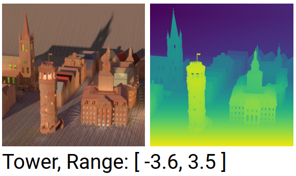

# CycleST
[](https://arxiv.org/abs/2003.09294)
[](https://www.youtube.com/watch?v=r9e4XoX07hE)  
This is an implementation of the paper "Self-Supervised Light Field Reconstruction Using Shearlet Transform and Cycle Consistency" in ***TensorFlow 2***.
If you find this code useful in your research, please consider citing [1, 2] and  
```
@article{gao2020self,
  title={Self-Supervised Light Field Reconstruction Using Shearlet Transform and Cycle Consistency},
  author={Gao, Yuan and Bregovic, Robert and Gotchev, Atanas},
  journal={IEEE Signal Processing Letters},
  volume={27},
  pages={1425--1429},
  year={2020}
}
```
This code has been tested on an Ubuntu 18.04 system using Tensorflow 2.1 and an NVIDIA GeForce RTX 2080 Ti GPU. 
If you have any question, please contact the first author at <yuan.gao@tuni.fi>.

## Getting started ##
### 1. Python requirements ###
Follow the instructions on the [TensorFlow official website](https://www.tensorflow.org/install) to install TensorFlow 2. In addition, we need Python Imaging Library (PIL) and SciPy libraries for image IO and shearing-related operations: 
``` bash
$ pip install Pillow scipy
```
### 2. Prepare datasets ###
A demo dataset `./demo/tower_r_5` is prepared here. 
Speicifially, this demo dataset is the 5-th horizontal-parallax light field of the 4D light field `Tower` from the [4D Light Field Benchmark](https://lightfield-analysis.uni-konstanz.de/) [3]:  
[](https://lightfield-analysis.uni-konstanz.de/)  
As can be seen from the above figure, the demo 3D light field has minimum disparity -3.6 pixels and maximum disparity 3.5 pixels. 
In addition, the demo 3D light field `tower_r_5` has 9 images (`0001-0009.png`), of which each has the same size of 512 x 512 pixels.   

### 3. Shearlet system construction
The construction of the elaborately-tailored shearlet system comes from the public [software](http://www.cs.tut.fi/~vagharsh/EPISparseRec.html) [1, 2].
In order to generate the shearlet system that can be used by CycleST, we suggest using the below code 
``` matlab
addpath('./shearlets');
kSize = 255;
nScale = 5;
sys = constructShearlet([kSize, kSize], 1:nScale); 
dec = sys.dec;
rec = sys.rec;
save(sprintf('st_%d_%d_%d', kSize, kSize, nScale), 'dec', 'rec');
```
The created mat file `st_255_255_5.mat` is placed in the `./shearlets` folder.  

### 4. Horizontal-parallax light field reconstruction ###
The goal of this demo is to reconstruct the above demo 3D light field `tower_r_5` from a Sparsely-Sampled Light Field (SSLF) with only three images: `0001.png`, `0005.png` and `0009.png`.
In other words, to generate this SSLF, the interpolation rate should be set to 4. 
Besides, the generated input SSLF has minimum disparity -14.4 pixels, maximum disparity 14 pixels and disparity range 28.4 pixels. 
The pre-trained model of CycleST is suitable for light field reconstruction on any input SSLF with disparity range up to 32 pixels.  
Let's evaluate the 3D light field reconstruction performance of CycleST by typing in the Terminal that
``` bash  
$ python predict.py --path_base=./demo --name_lf=tower_r_5 --angu_res_gt=9 --dmin=-3.6 --dmax=3.5 --interp_rate=4
```
The reconstructed horizontal-parallax light field is saved in `./demo/tower_r_5_lf_rec`. The intermediate results, i.e. reconstruced densely-sampled EPIs, are save in `./demo/tower_r_5_epi_rec`. 

### 5. Full-parallax light field reconstruction ###
In addition to the above 3D light field reconstruction, CycleST can also be applied to full-parallax (4D) light field reconstruction. 
Similarly, we prepare a demo 4D light field in `./demo/tower_4d` [3]. 
We use the same parameter configuration as the previous step to enhance the angular resolution from 3 x 3 to 9 x 9. 
``` bash
$ python predict.py --path_base=./demo --name_lf=tower_4d --angu_res_gt=9 --dmin=-3.6 --dmax=3.5 --interp_rate=4 --full_parallax
```
Refer to Fig. 6 (a) of [1] to get to know how to leverage 3D light field reconstruction approaches to perform full-parallax light fied reconstruction. 
The reconstructed 4D light field is saved in `./demo/tower_4d_lf_rec`.

## References ##
> [1] S. Vagharshakyan, R. Bregovic, and A. Gotchev, "Light field reconstruction using shearlet transform," IEEE TPAMI, vol. 40,
no. 1, pp. 133–147, 2018.  
> [2] S. Vagharshakyan, R. Bregovic, and A. Gotchev, "Accelerated shearlet-domain light field reconstruction," IEEE JSTSP, vol.
11, no. 7, pp. 1082–1091, 2017.  
> [3] K. Honauer, O. Johannsen, D. Kondermann, and B. Goldluecke, "A dataset and evaluation methodology for depth estimation on 4d light fields," ACCV, pp. 19-34, 2016.

## Acknowledgments ##
> This work was supported by the project “Modeling and Visualization of Perceivable Light Fields” funded by Academy of Finland under grant No. 325530 and carried out with the support of [Centre for Immersive Visual Technologies (CIVIT)](https://civit.fi/) research infrastructure, Tampere University, Finland.